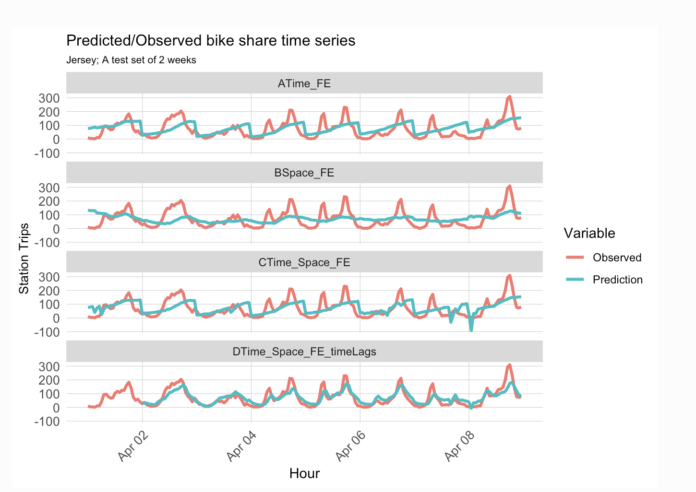

## Portfolio

---

Hello! I'm Jiatong Su, a passionate researcher and data analyst specializing in transportation planning, geospatial analysis, and data visualization. With a strong background in R, Python, GIS, and machine learning.

🚀 Skills & Tools

- Programming: Python (pandas, geopandas, matplotlib, scikit-learn), R (ggplot2, sf, tidymodels)
- Geospatial Analysis: GIS, QGIS, GeoJSON, Shapefiles
- Machine Learning: Regression, clustering, predictive modeling

### Feature project

[Forecast Metro train delays in and around NYC](https://sujiatong.github.io/Forecast_Metro_train_delays/ppa_final.html)

📍 Tools: R (regression, clustering)

📊 Summary: Developed a predictive model for NJ transit delays using real-time data.

---
[🚴Boston Blue Bike Stations dashboard](https://sujiatong.github.io/Boston_bike_dashboard/boston_bike/index.html)  

📍 Tools: JavaScript (Leaflet.js)
📊 Summary: Built an interactive map to analyze Boston’s bike-sharing network.

---
[🚲 Bike Share Demand Prediction](https://sujiatong.github.io/ppa_upenn/hw5b/Su_Jiatong_HW5b.html)

📍 Tools: R (time series modeling, machine learning)

📊 Summary: Forecasted bike-sharing demand using historical trends and weather data.

---

### Further feature project

- [Predicting Housing Prices in Philadelphia](https://sujiatong.github.io/ppa_upenn/ppa_final/PPA_midterm_Group%20Tong%20(2).html)
- [Bike Share Prediction](https://sujiatong.github.io/ppa_upenn/hw5b/Su_Jiatong_HW5b.html)
- [Geospatial Risk Prediction](https://sujiatong.github.io/ppa_upenn/HW3/Su_JiatongHW3.html)
- [STORYMAP PROJECT](https://sujiatong.github.io/story_map_project/jiatong_su/index.html)
- [Historical boundaries of world](https://sujiatong.github.io/engagement_project/frontend/index.html)

---

---

Page template forked from <a href="https://github.com/evanca/quick-portfolio">evanca</a>

<!-- Remove above link if you don't want to attibute -->
